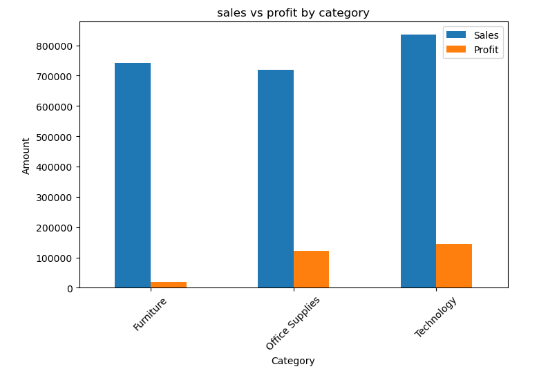
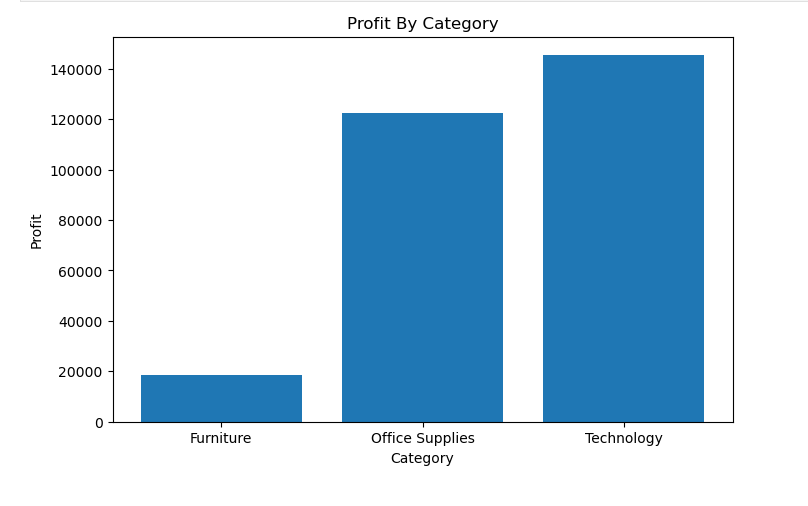
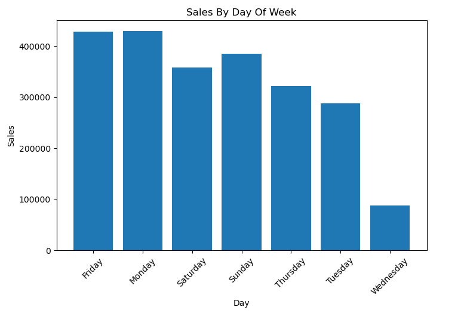

# 📊 Sales Data Analysis

## 📌 Objective

Analyze sales data to identify trends, category performance, and profit insights for business decision-making.

## 🛠 Tools Used

* Python
* Pandas
* Matplotlib

## 📊 Analysis Performed

* Monthly Sales Trends
* Day-wise Sales Analysis
* Category-wise Sales Distribution
* Profit Analysis
* Sales vs Profit Comparison

## 🖼️ Project Visuals

### Sales vs Profit

### Profit by Category

### Day-wise Sales

## 🔍 Key Insights

* Technology category has the highest sales and profit.
* Some categories generate high sales but lower profit margins.
* Sales show variation across different days of the week.
* Business should focus on high-profit categories for better growth.

## 🚀 Conclusion

This project demonstrates data analysis, visualization, and business insight generation using Python.
